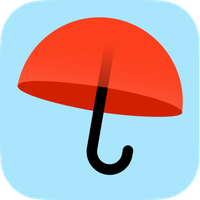

# YandexWeatherPlugin

<p align="center">
    
</p>

<p align="center">
  <a href="https://www.nuget.org/packages/mdimai666.Mars.Core">
    
  </a>
</p>

Gets weather from Yandex services.

# Features
- YandexWeatherNode
- Controller
    - WeatherWidgetResponse
    - GetCodes

## Output
```json
{
  "html": "<div class=\"ywp-yandex-weather\"> 10°C облачно</div>",
  "title": "10°C облачно",
  "stateDescription": "облачно",
  "celsiusText": "10°C",
  "iconCode": "ovc",
  "iconUrl": "/_plugin/YandexWeatherPlugin/icons/ovc.svg",
  "iconUrlFull": "http://localhost:5003/_plugin/YandexWeatherPlugin/icons/ovc.svg",
  "weather": {
    "id": 213,
    "name": "Москва",
    "skyColor": "#edcbb7",
    "temp": 10,
    "icon": "ovc",
    "link": "https://yandex.ru/pogoda/213?lat=55.755863&lon=37.6177",
    "parents": [
      {
        "id": 225,
        "name": "Россия"
      }
    ]
  },
  "locationTime": {
    "time": "04:41:39",
    "timeUnixTimeMillis": 1778560899174,
    "offset": 10800000,
    "offsetString": "UTC+3:00",
    "showSunriseSunset": true,
    "sunrise": "04:24",
    "sunset": "20:27",
    "isNight": false
  }
}
```
